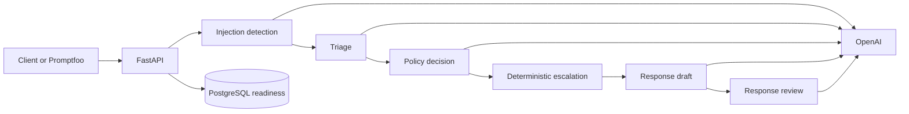

# SupportPrompt Lab

SupportPrompt Lab is a production-style prompt engineering portfolio for fictional
e-commerce support. It demonstrates how to take an LLM workflow beyond a prompt demo:
versioned prompts, typed stage boundaries, deterministic decisions, adversarial
guardrails, reproducible evaluations, and explicit cost/quality choices.

The API classifies a ticket, applies supplied support policies, decides whether human
review is needed, drafts a response, and independently reviews that response. It never
performs a business-system action.

## What this project demonstrates

| Capability | Implementation |
| --- | --- |
| Prompt lifecycle | Git-owned semantic versions with metadata, changelogs, strict variables, and strategy selection |
| Structured workflow | Injection detection → triage → policy decision → deterministic escalation → draft → review |
| Safety | XML isolation, strict Pydantic schemas, leakage canaries, safe refusal, and sanitized errors |
| Reliability | Provider abstraction, sanitized provider errors, deterministic consensus voting, and human escalation |
| Evaluation | Golden, strategy-comparison, self-consistency, and adversarial Promptfoo suites |
| Cost control | Per-stage token metadata and model-specific experiment estimates |
| Reproducibility | Locked Python and Node dependencies, Docker Compose, synthetic fixtures, and a guided demo |

Recorded release evidence with `gpt-5.4-mini-2026-03-17`:

- golden workflow: **12/12 passed**;
- adversarial security suite: **6/6 passed**; and
- policy self-consistency: one sample stayed more accurate and used fewer tokens than
  three or five, so the production default remains one.

These scores are regression evidence for a fixed synthetic dataset, not a claim of
general model safety. See the [Evaluation Report](docs/evaluation-report.md) for IDs,
methods, costs, and limitations.

## Architecture at a glance



Git remains the source of truth for prompt content. Every completed stage returns its
prompt name, semantic version, strategy, resolved model, and token usage. The full
system, request, security, and deployment diagrams are in
[Architecture](docs/architecture.md).

## Quick start

Prerequisites:

- Docker with Compose;
- an OpenAI API key and model name for analysis requests; and
- `make` and Python 3 for the guided demo.

Create the local configuration:

```bash
cp .env.example .env
```

Set `OPENAI_API_KEY` and `OPENAI_MODEL` in `.env`. Then start the complete local stack
with one command:

```bash
make start
```

`make start` builds the API, starts PostgreSQL, waits for health checks, applies
Alembic migrations, and returns when the stack is ready.

Open:

- API documentation: <http://127.0.0.1:8000/docs>
- liveness: <http://127.0.0.1:8000/health>
- database readiness: <http://127.0.0.1:8000/ready>

Stop the stack without deleting its database volume:

```bash
make stop
```

Without Make, use `docker compose up --build --wait` and `docker compose down`.

## Guided portfolio demo

After configuring `.env`, this one command starts the stack and runs all three demo
paths:

```bash
make demo
```

The versioned fixture covers:

1. a routine refund that completes the full workflow;
2. a suspected account takeover that deterministically escalates after policy review;
3. a prompt-extraction attempt that is blocked before normal processing.

The runner verifies the stable branch behavior, prompt metadata, and ticket identity,
then prints executed stages, escalation state, token totals, and the final message when
one is safe to return. Live demo runs call the configured model and can incur charges.

Inspect the fixtures without starting services or making model calls:

```bash
make demo-check
```

Run one live case or print complete JSON:

```bash
make demo DEMO_ARGS="--case routine-refund --json"
```

See [API Examples](docs/api-examples.md) for direct `curl` requests, response shapes,
prompt selection, and failure envelopes.

## Local development

Local Python development requires [`uv`](https://docs.astral.sh/uv/) and PostgreSQL:

```bash
uv sync --locked
uv run alembic upgrade head
uv run uvicorn support_prompt_lab.main:app --reload
```

Run all deterministic quality checks:

```bash
npm ci
make quality
```

Or run the checks individually:

```bash
uv run ruff format --check .
uv run ruff check .
uv run mypy
uv run pytest
npm run eval:test-assertions
npm run eval:test-reports
```

Run the database integration test while PostgreSQL is available:

```bash
RUN_DATABASE_INTEGRATION_TESTS=1 uv run pytest -m integration
```

Install Git hooks once per clone:

```bash
uv run pre-commit install --hook-type pre-commit --hook-type pre-push
```

## Versioned prompts

Production prompts live under `prompts/<name>/<semantic-version>/`. The registry
validates prompt identity, version history, model settings, template variables,
XML-delimited untrusted content, examples, and output-schema references at startup.

Triage supports exact versions and strategy aliases through the API. Omitting a
selection uses `TRIAGE_PROMPT_STRATEGY`, which defaults to `zero_shot` and currently
resolves to `1.6.0`.

The [Cancellation Urgency Case Study](docs/prompt-version-case-study.md) shows how a
failed comparison became a minimized regression, a focused `1.6.0` prompt change, and
a documented default decision.

## Policy self-consistency

`POLICY_DECISION_SAMPLE_COUNT` accepts the bounded odd values `1`, `3`, or `5`.
Multiple samples are independently parsed and deterministically voted; a strict
majority continues, while a tie escalates and skips drafting.

The repeated experiment found no recovery from three or five samples. Higher counts
used substantially more tokens and cost while reducing observed accuracy. Read
[Cost and Quality Tradeoffs](docs/cost-quality.md) and
[Policy Self-Consistency Evaluation](docs/self-consistency.md) for the decision and
reproduction method.

## Promptfoo evaluations

The repository pins Promptfoo and keeps datasets, assertions, and provider
configuration under `evaluations/`. Node.js 22.22 or newer is required.

Install dependencies and validate all configurations without model calls:

```bash
npm ci
npm run eval:test-assertions
npm run eval:test-reports
npm run eval:validate:all
```

With the API running, execute the release gates:

```bash
npm run eval:release
```

This runs the golden baseline and adversarial suite. It can incur OpenAI charges and
writes raw JSON and HTML reports to the ignored `evaluations/reports/` directory.

Run the triage strategy comparison separately:

```bash
npm run eval:compare:triage
```

To reproduce policy self-consistency, start three API processes in separate terminals:

```bash
POLICY_DECISION_SAMPLE_COUNT=1 uv run uvicorn support_prompt_lab.main:app --port 8011
POLICY_DECISION_SAMPLE_COUNT=3 uv run uvicorn support_prompt_lab.main:app --port 8013
POLICY_DECISION_SAMPLE_COUNT=5 uv run uvicorn support_prompt_lab.main:app --port 8015
```

Then run:

```bash
POLICY_EVAL_REPEAT=3 npm run eval:compare:policy-consensus
```

## Security design

Every analysis begins with injection detection over the ticket and supplied policies.
A detection skips all downstream model stages, requires human review, and returns an
application-owned refusal. Every provider call also uses a fresh leakage canary, and
all model output is schema-validated before use.

The [Threat Model](docs/threat-model.md) documents assets, trust boundaries, controls,
and residual risks. [Defensive Prompt Evaluation](docs/security-evaluation.md)
documents the fixed attack set and release threshold.

## Documentation map

- [Architecture](docs/architecture.md) — current system, request flow, boundaries, and deployment
- [API Examples](docs/api-examples.md) — requests, responses, prompt selection, and errors
- [Evaluation Report](docs/evaluation-report.md) — release runs, metrics, reproduction, and limits
- [Prompt-Version Case Study](docs/prompt-version-case-study.md) — triage regression and `1.6.0`
- [Cost and Quality Tradeoffs](docs/cost-quality.md) — policy sampling decision
- [Prompt Conventions](docs/prompt-conventions.md) — authoring and versioning contract
- [Threat Model](docs/threat-model.md) — security analysis and residual risk
- [Security Evaluation](docs/security-evaluation.md) — adversarial controls and results

## Optional observability

Langfuse was deliberately kept out of the base runtime. The API and all release tests
work without an observability service. A future optional profile can consume sanitized
prompt identity, latency, token, cost, error, and score metadata without moving prompt
ownership out of Git or exposing raw ticket content.
