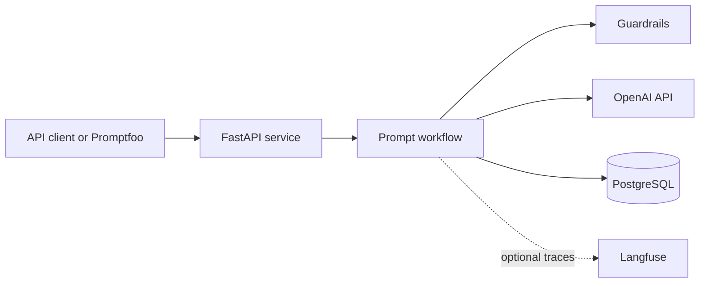

# Architecture

## Purpose

SupportPrompt Lab is a production-style prompt engineering service for fictional
e-commerce support tickets. It will classify tickets, apply supplied policies, decide
whether escalation is required, draft a response, review that response, and return a
validated JSON result.

This document distinguishes the foundation that exists today from components planned
for later milestones.

## System context

The FastAPI service is the only public application boundary. PostgreSQL, model calls,
and optional observability are accessed through internal adapters. Promptfoo acts as
an external API consumer so evaluations exercise the same boundary as real requests.

## Current foundation

The current implementation provides:

- A Python 3.13 application managed and locked with `uv`.
- A FastAPI process with `/health` and `/ready` operational endpoints.
- Pydantic settings loaded from environment variables or a local `.env` file.
- An asynchronous SQLAlchemy engine using the PostgreSQL `asyncpg` driver.
- Alembic migration infrastructure and an initial schema revision.
- A multi-stage API image and a Docker Compose PostgreSQL service.
- Automated formatting, linting, type checking, unit tests, and an opt-in database
  integration test.

Prompt orchestration, model integration, prompt storage, application tables,
guardrails, and tracing are intentionally deferred to later milestones.

## Target module boundaries

The application will evolve toward these internal areas under
`src/support_prompt_lab/`:

| Area | Responsibility | May depend on |
| --- | --- | --- |
| `api` | HTTP routes, request parsing, response serialization | `application`, `domain` |
| `application` | Prompt-chain orchestration and use cases | `domain`, adapter interfaces |
| `domain` | Tickets, policies, decisions, and evaluation rules | Standard library and Pydantic contracts |
| `infrastructure` | OpenAI, PostgreSQL, and Langfuse adapters | External SDKs, `domain` interfaces |
| `guardrails` | Injection, leakage, input, and output checks | `domain` |
| `observability` | Sanitized traces, latency, token, and cost metrics | Adapter interfaces |

Dependency flow points inward: infrastructure and API code may depend on domain
contracts, but domain code must not depend on FastAPI, SQLAlchemy, or a model-provider
SDK. This keeps core decisions testable with deterministic fakes.

## Planned request flow

`POST /v1/tickets/analyze` will process a request in the following order:

1. FastAPI validates request shape and size.
2. Guardrails treat ticket and policy text as untrusted input and screen it for
   unsupported or malicious instructions.
3. The triage stage classifies intent, urgency, and sentiment.
4. The policy stage applies supplied policy identifiers and rules.
5. Deterministic application logic decides whether human escalation is required.
6. The drafting stage produces a policy-constrained response.
7. The review stage checks and, when necessary, revises the draft.
8. Pydantic validates the final structured result before serialization.
9. Sanitized metrics and version metadata are persisted; raw ticket logging remains
   disabled by default.

Each stage receives only the data it needs and returns a typed result. A stage failure
must become a controlled error or safe escalation rather than an unvalidated partial
response.

## Runtime and deployment

Docker Compose defines two services:

- `db` runs PostgreSQL with a persistent named volume and a `pg_isready` health check.
- `api` waits for a healthy database, applies `alembic upgrade head`, and then starts
  Uvicorn as a non-root user.

The operational endpoints have separate meanings:

- `/health` is a liveness check. It confirms that the API process can serve requests.
- `/ready` is a readiness check. It executes `SELECT 1` and returns `503` when the
  database is unavailable.

Automatic migrations are suitable for the current single-instance development stack.
If the service later runs multiple replicas, migrations should move to a single
deployment job to avoid concurrent schema changes.

## Configuration and secrets

Configuration enters through environment variables and is validated by Pydantic.
`.env.example` contains development defaults only; `.env` is excluded from Git.
Credentials and API keys must never appear in source files, prompt templates, fixture
outputs, container images, or logs.

Required future secrets include the OpenAI API key and, when enabled, Langfuse
credentials. Production deployments must inject them through the deployment
environment's secret manager.

## Data ownership

PostgreSQL will store structured application state, prompt-run metadata, and sanitized
metrics. Git remains the source of truth for prompt text and prompt metadata. Langfuse
may receive prompt identifiers and trace metadata but does not own prompt versions.

Only synthetic tickets and fictional policies are in scope. Authentication, queues,
RAG, fine-tuning, and a custom frontend are outside the MVP.

## Architecture rules

- Validate external input and model output at system boundaries.
- Keep production prompt text out of Python source code.
- Use explicit adapter interfaces for model, persistence, and tracing integrations.
- Make optional integrations fail open only when doing so cannot weaken safety or
  policy compliance.
- Record prompt name and version with every model result.
- Prefer deterministic application logic for voting, thresholds, and escalation.
- Never expose hidden model reasoning; return concise decision rationales and policy
  identifiers instead.

