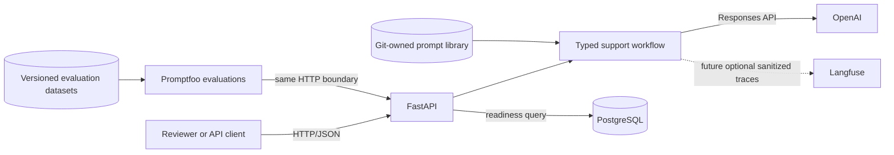
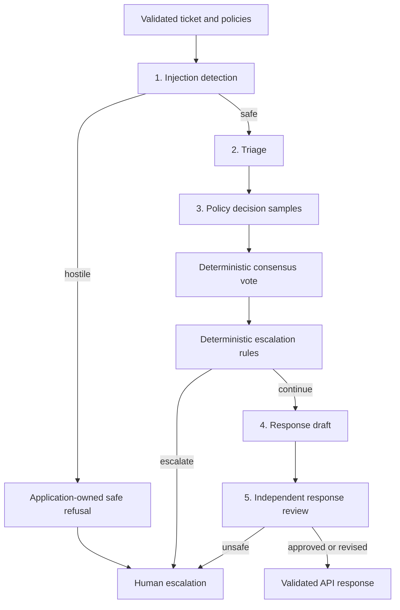

# Architecture

## System purpose

SupportPrompt Lab is a production-style prompt engineering service for fictional
e-commerce support tickets. It combines versioned prompts with typed model boundaries,
deterministic policy controls, adversarial defenses, and reproducible evaluations.

The application does not perform refunds, cancellations, or account changes. It
classifies a request, applies supplied fictional policies, decides whether human review
is required, and drafts a response only when the request can be handled safely.

## System context


```mermaid
flowchart LR
    Reviewer[Reviewer or API client] -->|HTTP/JSON| API[FastAPI]
    Promptfoo[Promptfoo evaluations] -->|same HTTP boundary| API
    API --> Workflow[Typed support workflow]
    Workflow -->|Responses API| OpenAI[OpenAI]
    API -->|readiness query| DB[(PostgreSQL)]
    Registry[(Git-owned prompt library)] --> Workflow
    Dataset[(Versioned evaluation datasets)] --> Promptfoo
    Workflow -. future optional sanitized traces .-> Langfuse[Langfuse]
```

FastAPI is the only public application boundary. Promptfoo intentionally exercises the
same endpoint as a normal client. PostgreSQL currently supports deployment readiness
and migration infrastructure; ticket results are not persisted. Langfuse is an optional
future integration and is not required to run this release.

## Request flow


```mermaid
flowchart TD
    Request[Validated ticket and policies] --> Injection[1. Injection detection]
    Injection -->|hostile| SafeRefusal[Application-owned safe refusal]
    SafeRefusal --> Human[Human escalation]
    Injection -->|safe| Triage[2. Triage]
    Triage --> Policy[3. Policy decision samples]
    Policy --> Vote[Deterministic consensus vote]
    Vote --> Rules[Deterministic escalation rules]
    Rules -->|escalate| Human
    Rules -->|continue| Draft[4. Response draft]
    Draft --> Review[5. Independent response review]
    Review -->|approved or revised| Response[Validated API response]
    Review -->|unsafe| Human
```

`POST /v1/tickets/analyze` processes a request in this order:

1. Pydantic rejects malformed, oversized, or unexpected request fields.
2. Injection detection inspects the ticket and supplied policies as untrusted data.
3. Triage classifies intent, urgency, and sentiment with a selected prompt version.
4. The policy stage runs one, three, or five independent samples and uses deterministic
   voting. The production default is one because higher counts did not improve the
   recorded evaluation.
5. Application rules stop the workflow when the decision is unsafe, out of scope, or
   missing required information.
6. The draft stage produces a policy-constrained customer message.
7. The review stage approves, revises, or rejects that draft.
8. The API serializes only validated domain models and sanitized execution metadata.

Every model call uses the same leakage-protected client. It adds a request-specific
canary to the trusted system message and scans the raw provider response before any
stage-specific parser sees it. Raw provider output is never returned on failure.

## Internal boundaries

```text
src/support_prompt_lab/
├── api/              HTTP contracts, error mapping, dependency wiring
├── application/      Prompt stages, orchestration, voting, guardrails
│   └── ports/        Provider-independent model interface
├── domain/           Strict ticket, decision, draft, and review models
├── infrastructure/   OpenAI adapter and sanitized provider errors
└── prompts/          Registry, metadata validation, rendering, semantic versions
```

| Area | Responsibility | Important constraint |
| --- | --- | --- |
| `api` | Validate and serialize the public HTTP contract | Never exposes provider errors or raw output |
| `application` | Coordinate stages and deterministic decisions | Depends on the model port, not the OpenAI SDK |
| `domain` | Express valid states with Pydantic and enums | Has no FastAPI or provider dependency |
| `infrastructure` | Translate OpenAI responses into the model port | Maps external failures to sanitized errors |
| `prompts` | Load immutable prompt versions from Git | Strict variables, XML escaping, and metadata |

Dependency flow points inward. Domain and application rules are testable with a
deterministic fake model client; the OpenAI adapter is replaceable at the port.

## Prompt ownership and selection

Git is the source of truth for prompts. Each version lives under
`prompts/<name>/<semantic-version>/` with system and user templates, metadata, and any
examples. The registry validates the full library at startup and records prompt name,
version, strategy, model, and token usage in each public stage result.

Triage supports controlled selection by semantic version or by `zero_shot`,
`few_shot`, or `many_shot` strategy. The configured default is `zero_shot`, currently
resolved to `1.6.0`. Other stages use their latest compatible version.

## Security boundaries


```mermaid
flowchart LR
    Untrusted[Ticket and policy text] -->|Pydantic limits| Delimited[XML-escaped data sections]
    Delimited --> Detector[Injection detector]
    Detector -->|allowed| Provider[Model provider]
    Provider --> Canary[Leakage-canary scan]
    Canary --> Schema[Strict stage schema]
    Schema --> Rules[Policy and escalation rules]
    Rules --> Public[Public response]
```

The service treats caller content and model output as untrusted. It does not execute
model-suggested tools, commands, URLs, or markup. A validation failure becomes a
sanitized workflow error; a detected injection takes a fixed refusal path. Complete
prompts, provider error bodies, credentials, and raw customer content are excluded from
application logs and future observability payloads.

See [Threat Model](threat-model.md) and
[Defensive Prompt Evaluation](security-evaluation.md) for controls, evidence, and
residual risk.

## Runtime and deployment

Docker Compose defines two required services:

- `db` runs PostgreSQL 17 with a named volume and a `pg_isready` health check.
- `api` waits for a healthy database, applies `alembic upgrade head`, and starts
  Uvicorn as a non-root user.

`/health` checks process liveness. `/ready` executes `SELECT 1` and returns `503` when
PostgreSQL is unavailable. Automatic migrations are appropriate for this local,
single-instance portfolio stack; a multi-replica deployment should move migrations to
a single deployment job.

Configuration is loaded from environment variables through Pydantic settings.
`.env.example` documents development values, while `.env` is excluded from Git. The
OpenAI key is required only for model-backed analysis, not for health checks or the
deterministic test suite.

## Verification layers

| Layer | What it proves |
| --- | --- |
| Unit and contract tests | Domain invariants, prompt rendering, workflow branches, API errors |
| Database integration test | PostgreSQL readiness behavior |
| Golden Promptfoo suite | Expected behavior across 12 supported and edge cases |
| Strategy comparison | Prompt-version regressions and quality differences |
| Self-consistency experiment | Accuracy, latency, token, and cost tradeoffs |
| Adversarial suite | Injection blocking, marker suppression, and safe refusal |

Recorded results and reproduction commands are in
[Evaluation Report](evaluation-report.md).

## Deliberate scope

The MVP uses synthetic tickets and fictional policies. Authentication, production
authorization, queues, RAG, fine-tuning, business-system actions, and a custom frontend
are out of scope. Langfuse observability remains an optional follow-on milestone; the
core API has no runtime dependency on it.
