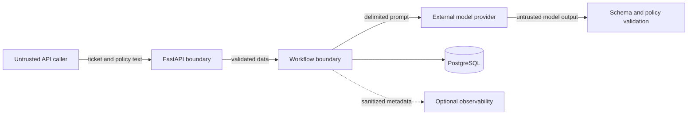

# Threat Model

## Scope

This threat model covers the SupportPrompt Lab API, prompt workflow, PostgreSQL data,
model-provider boundary, evaluation tooling, containerized development environment,
and optional Langfuse integration.

The MVP uses synthetic tickets and fictional policies. The controls still assume that
ticket and policy fields may contain hostile content.

## Security objectives

- Model output follows trusted system instructions and supplied support policy.
- Untrusted text cannot change application rules, reveal prompts, or trigger tools.
- API responses always conform to a validated schema.
- Secrets, complete system prompts, and raw ticket content do not enter logs or traces.
- A model or integration failure produces a safe error or human escalation.
- Stored prompt versions, migrations, and evaluation results remain reproducible.

## Assets

| Asset | Security concern |
| --- | --- |
| System prompts and policy rules | Integrity and limited disclosure |
| OpenAI and optional Langfuse credentials | Confidentiality |
| Synthetic ticket and policy content | Integrity and privacy-by-design |
| Classification and escalation decisions | Integrity and availability |
| Drafted support responses | Policy compliance and safety |
| PostgreSQL data and migrations | Integrity, availability, and traceability |
| Evaluation datasets and reports | Integrity and reproducibility |
| Logs, traces, token counts, and cost data | Confidentiality and minimization |

## Trust boundaries

Inputs from API callers, evaluation datasets, policy fields, and the model are
untrusted. Model output is not trusted merely because it was produced in response to a
system prompt.

## Threats and controls

| Threat | Example | Required controls | Status |
| --- | --- | --- | --- |
| Prompt injection | A ticket says to ignore the system prompt | Instruction hierarchy, XML isolation, length limits, injection checks, safe escalation | Planned |
| Prompt extraction | A ticket requests hidden rules or examples | Refusal rules, leakage canaries, output scanning, red-team tests | Planned |
| Malicious policy text | A supplied policy contains fake system instructions | Treat policy text as data, delimit it separately, accept only expected policy fields | Planned |
| Schema evasion | The model emits prose, malformed JSON, or extra fields | Strict Pydantic models, forbidden extras, bounded retries, safe failure | Planned |
| Policy violation | A draft promises a refund outside policy | Typed policy decision, policy identifiers, independent review stage, deterministic escalation | Planned |
| Hidden-reasoning exposure | A response returns internal deliberation | Request concise rationale only and reject reasoning-like fields | Planned |
| Sensitive logging | Raw ticket text or secrets appear in traces | Structured allowlist logging, redaction, raw-content logging disabled by default | Planned |
| Dependency compromise | A package or container tag changes unexpectedly | Lock Python dependencies, pin critical automation and image versions, review upgrades | Partial |
| Database unavailability | PostgreSQL is offline during a request | Readiness checks, timeouts, controlled `503` responses, no partial persistence | Partial |
| Model outage or throttling | OpenAI times out or returns `429` | Timeouts, bounded retry with jitter, explicit error mapping, escalation | Planned |
| Cost or token exhaustion | Oversized input or repeated sampling drives cost | Input limits, token budgets, request limits, cost metrics, sampling caps | Planned |
| Cross-request leakage | One customer's content appears in another result | Request-scoped state, no shared mutable prompt state, isolation tests | Planned |
| Unsafe observability failure | Tracing outage blocks requests or leaks payloads | Optional sanitized tracing, bounded timeouts, failure isolation | Planned |

## Input handling requirements

- Apply request size and field-length limits before invoking a model.
- Preserve a strict instruction hierarchy: application rules are trusted; ticket and
  policy text are not.
- Place untrusted fields in separate, named XML elements and escape delimiter-like
  content before rendering.
- Do not interpolate untrusted content into system instructions or metadata fields.
- Reject unsupported content types and invalid encodings.
- Treat detection signals as evidence for safe handling, not proof that an input is
  harmless.

## Output handling requirements

- Parse model output into a stage-specific Pydantic model with unknown fields denied.
- Enforce enum values, length limits, required policy references, and escalation rules
  outside the model.
- Never execute commands, URLs, markup, or tool requests found in model output.
- Return only the public response contract; omit prompts, raw provider responses, and
  internal exception details.
- If validation or review cannot establish a safe result, require human escalation.

## Data and logging policy

- Use synthetic ticket data throughout the MVP.
- Log identifiers, prompt versions, latency, token counts, estimated cost, outcome,
  and trace ID through an allowlist.
- Do not log raw tickets, complete prompts, authorization headers, database URLs, API
  keys, or provider error bodies that may echo request content.
- Give stored evaluation artifacts explicit retention and deletion rules before using
  non-synthetic data.

## Container and database controls

- The API container runs as a non-root user.
- PostgreSQL is not a public application interface; published ports are for local
  development only.
- Database credentials come from environment variables and development defaults must
  not be reused in deployed environments.
- Alembic migrations are reviewed source code. Destructive migrations require a
  backup and rollback plan.
- `/health` reveals process status only; `/ready` reveals dependency availability but
  no connection details.

## Verification strategy

Security verification will include unit, contract, integration, and adversarial tests
for:

- Instruction overrides, fake system messages, jailbreaks, and delimiter attacks.
- Prompt extraction and leakage-canary detection.
- Malicious ticket and policy fields.
- Invalid, truncated, oversized, or schema-breaking model responses.
- Timeout, authentication, rate-limit, and provider-format failures.
- Absence of secrets, complete prompts, and raw ticket text from logs.
- Correct refusal and escalation behavior when safe completion is impossible.

Promptfoo red-team suites will make failures reproducible. A documented pass threshold
and accepted residual risks are required before the portfolio release.

## Residual risks

Prompt injection cannot be eliminated solely through prompt wording. Layered
validation, limited capabilities, deterministic policy checks, monitoring, and human
escalation remain necessary. Model-provider behavior may also change between model
versions, so every model or prompt-version change requires regression evaluation.

